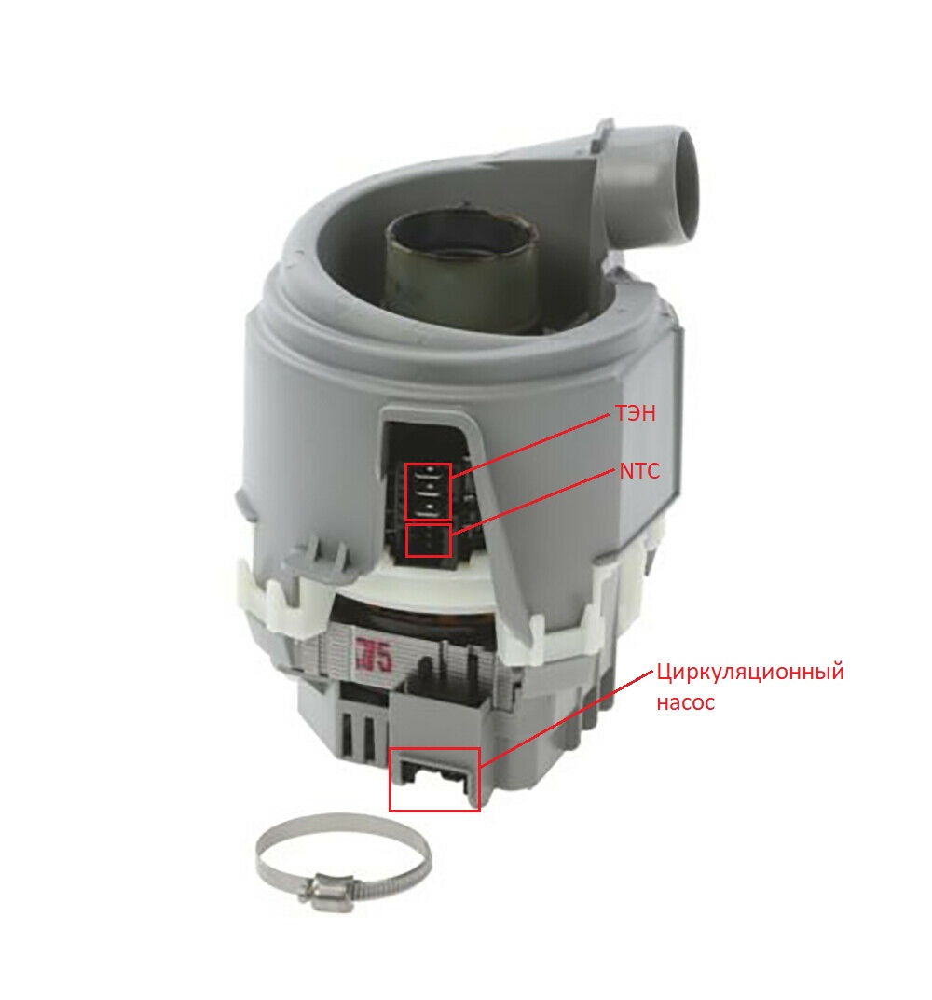

# Ремонт посудомойки Siemens SN64E002SK/43
## Проблема: не греет воду
Машина или не греет воду совсем, или греет её периодически, или греет только самый первый раз после включения.
### Причина: выход из строя ТЭНа
__Устройство__: 
Проточный ТЭН и рециркуляционный насос идут в сборе одним блоком. 

ТЭН включается микроконтроллером по давлению, создаваемому рециркуляционным насосом. В свою очередь давление определяется тем же микроконтроллером по току, потребляемому тем же рециркуляционным насосом.
[Источник](http://monitor.espec.ws/section7/topic318705.html)

При слабом насосе ТЭН не включается => менять только на ТЭН нужной мощности, хотя могут подойти разные.
[Источник](http://monitor.espec.ws/section7/topic278332.html)

На ТЭНе два последовательно включённых NTC по 10к.
[Источник](http://monitor.espec.ws/section7/topic241629.html)

__Диагностика__:  
1. Норма: сопротивление на контактах ТЭНа 19-20 Ом
2. Норма: нет замыкания между контактами ТЭНа и общим (самым длинным) контактом
3. Норма: сопротивление двух NTC датчиков одинаковы ~9-10 кОм

__Замена__: 
Оригинальный номер детали ТЭН+насос -- `9000658862-P0006/12` меняется деталью `00651956`
[Источник](https://www.elremont.ru/forum/viewtopic.php?t=30618)
